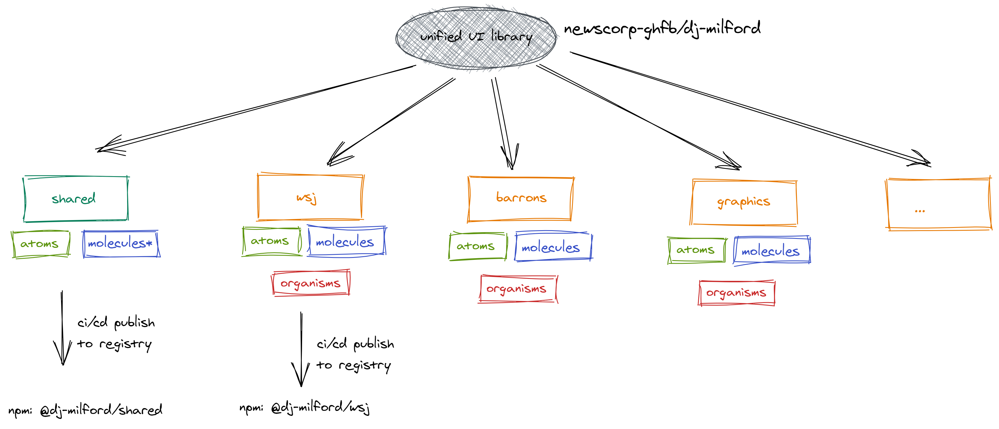
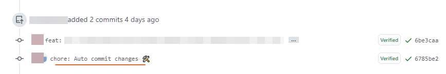
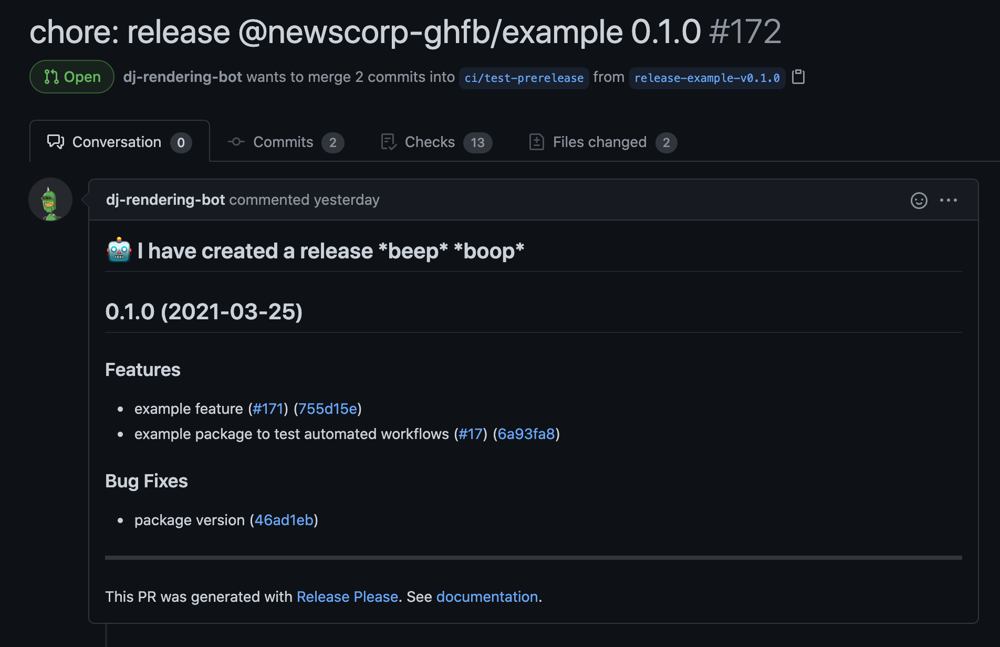
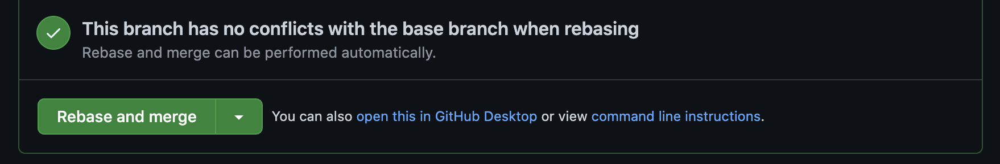

# dj-rendering

This is repo for documenting common standards & guidelines for DJ Rendering UI library.



## Standards & Guidelines

### Documentation

### Brief guide to repo structure 🗺

- `docs/` contains assets, components, and guides
- `packages/` contains the source code, storybook data and tests of all components
  - `/packages/:package` Contains groups of components that are logical to separate. This can be grouped by brand - like WSJ, Barrons etc or by application. For example

```bash
.
└── packages
    ├── newsletter-center
    │   ├── icons
    │   ├── index.js # entry point
    │   ├── readme.md # README for each component
    │   └── ...
    └── wsj
        ├── header
        │   ├── index.js
        │   └── ...
        └── footer
            ├── index.js
            └── ...
```

### Storybook

Storybook is used to preview and document our UI components. [See our guidelines here](docs/storybook.md).

### Tests

The library's NPM modules should be maintained like an open-source project. As such, each contributor should write tests that ensure that whoever picks up their component can be sure of its functionality

**Unit tests** should be a fundamental part of each component added to the library. Their goal is to test the component output, given props and to ensure smooth refactoring is possible with high trust in the end result.

The library is using `Jest` as a test runner and `React Testing Library` for API and a test helper when working with components

When designing tests, follow industry standards described here: [React Testing](https://reactjs.org/docs/testing-recipes.html) and [React Testing Library helpers](https://testing-library.com/docs/react-testing-library/api)

**Integration tests** can be achieved by using visual rendering tools such as Storybook. There, we should expect to visualise and preview components. More in the Storybook section above.

**Page Browser tests** is the domain of each team and not part of this library. They would be responsible for creating end-to-end testing suite to test their web pages as desired. Some tools to use could be:

- New Relic Syntetics
- Selenium Web Driver / Mocha
- Nightwatch / Cucumber

#### Testing Principles

1. Each component should contain tests that cover **all** real-use cases as well as edge-cases
2. Don't test child components; they should have their own tests. Consider using mocks if necessary.
3. Dependencies, even built-in one like setTimeOut should be mocked
4. API calls should be stubbed/mocked
5. When refactoring components, failed tests should not be ignored. This might indicate app will fail with the newer version of the library.
6. Difficult to test component might indicate badly written one - consider refactoring it to reduce effects/dependancies

#### Snapshot tests

We should avoid using snapshot tests. While easy to set up, they can lead to poor functionality coverage and can lead to developer detachment from the testing problem.

#### Test coverage

While flawed, it is the metric we have to use to ensure teams follow testing requirements. As such, the library enforces minimum testing coverage for each and every component.

The following minimums would be set:

```json
  "global": {
    "branches": 80,
    "functions": 80,
    "lines": 80,
    "statements": 80
  },
  "./packages/shared": {
    "branches": 90,
    "functions": 90,
    "lines": 90,
    "statements": 90
  },
```

### Customizable (themes, styles)

### Shared components decision tree

How do I decide if a component should be shared? Refer to [Component Design/Shared Components Decision Tree](docs/component-design.md#shared-components-decision-tree) for the checklist and process to do so.

### Should it be a stand-alone package?

There are times when a component might offer utility across so many use-cases that it merits its own repository. Refer to the [stand-alone guidelines](docs/stand-alone-guidelines.md) for more information.

### CI/CD Process

#### Automated versioning

During deployment, we automatically bump package versions based on [Conventional Commits](https://www.conventionalcommits.org/).

`lerna version --conventional-commits` will use the Conventional Commits Specification to [determine the version bump](https://github.com/conventional-changelog/conventional-changelog/tree/master/packages/conventional-recommended-bump). [Release-please](https://github.com/google-github-actions/release-please-action) will generate `CHANGELOG.md` files.

##### On merge to `main`

With the `--conventional-prerelease` flag, `lerna version --conventional-commits`
creates pre release versions by suffixing the version recommendation from conventional commits with `beta`, e.g. `0.2.0-beta.0`. Subsequent merges to `main` will bump the final integer, e.g. `0.2.0-beta.1` and so on.

Release-please will open a new PR against `main` to bump the version number and update the package's `CHANGELOG.md`. Merging this PR will trigger a new release. Release-please will keep the changelog in sync with subsequent merges to `main` before the next release.

##### On release deploy

With the `--conventional-graduate` flag, `lerna version --conventional-commits` graduates the specified packages with the version recommendation from conventional commits. Releases are triggered by merging the relevant release PR.

#### PR deploys

Pull requests may be published by adding the `deploy` label to the pull request. The PR will be deployed as a prerelease using the PR number as an identifier, e.g. `0.2.0-pr55.0`. Subsequent commits to the PR will bump the final integer, e.g. `0.2.0-pr55.1` and so on.

A `dist-tag` will be generated at publish time based on the pr number, e.g. `pr55`. You may use this value as a version identifier in `package.json` files or install commands:

```json
{
  "name": "my-app",
  "devDependencies": {
    "@newscorp-ghfb/<pkg>": "pr55"
  }
}
```

```bash
yarn add @newscorp-gfhb/wsj-components@pr55
```

To install subsequent releases, you may upgrade like any other node module:

```bash
yarn upgrade @newscorp-ghfb/<pkg>
```

**Note** that doing this will change the version identifier from the `dist-tag` (`pr55`) to a resolved version range, e.g. `^0.2.0-pr55.1`.

This is needed since yarn will lock the version number and will not install later releases unless you explicitly upgrade the pr, e.g. if you install `0.2.0-pr55.0` and later release `0.2.0-pr55.1`, yarn will continue to install `.0` on builds in CI environments.

#### Automated linting, fixing

[`.github/workflows/coding-standards.yml`](./.github/workflows/coding-standards.yml) runs linting and provides automatic fixes when feasible. Any linting errors that cannot be auto-fixed are bubbled up for the developer to fix. The PR will show any linting failures as failed status checks preventing merges to `main`.

##### Linter workflow

When a commit is pushed to a PR:

- run prettier to format code according to defined rules
- if changes made, auto commit them to PR
- attempt linting most recent code
- if no errors, report status `PASS`
- if errors, report status `FAIL` (blocks PR from getting merged)

Example auto fix commit:



#### Automated testing

[`.github/workflows/coding-standards.yml`](./.github/workflows/coding-standards.yml) also runs unit testing for each commit as it is pushed in a PR. The PR is blocked from merging if tests fail. PRs may be published for development purposes using the `deploy` label. Failing tests will not prevent PRs from publishing.

#### Automated deployments

When a PR is merged to `main` branch, [`.github/workflows/continuous-deploy.yml`](./.github/workflows/continuous-deploy.yml) triggers an automatic deploy of the **_changed_** packages to create a **prerelease** version of the package. This enables users to start using the changes immediately without releasing an unstable version in the wild.

Automatic deploy follows these rules:

- check if `no-deploy` label is applied to PR. If so, skip deploy. This is an escape hatch for emergency cases and should not be used normally
- run unit tests
- run `lerna changed` to get a list of changed packages
- for every package `lerna` identifies, `release-please` opens a new PR for the release associated with this prerelease (e.g. a PR for `v1.1.0` for `v1.0.0-beta.0`)
- run `lerna publish --conventional-commits --conventional-prerelease` to create pre release packages in the npm registry

Once a package is deemed stable, a new version can be released by triggering the [release workflow](#automated-releases).

#### Automated PR process helpers

In order to ease the maintenance burden on library maintainers, there are several automated chores that get executed when a PR is opened/changed. Some of these are:

- **PR Labeler** - Adds a repo label based on changed files. This allows developer to quickly sort out what relevant PRs based on their domain.
- **PR Size** - Analyzes changed files, insertions/deletions per file and total number of changes for the changeset and adds a t-shirt size label. It also posts a helpful comment explaining what it means. E.g., PR sizes of `small`, `medium` are preferred and encouraged. `large` PRs are borderline acceptable if the reviewers agree (the dev needs to provide reasons as to why this couldn't be broken into smaller PRs). `x-large` PRs are a strict no no and should be refactored.
- **Stale** - Labels PRs with no activity and cleans them up if no further activity is found after a certain amount of time.
- **Semantic Pull Request** - ensures pull request title or at least one commit (in case of single commit PRs) conforms to [Conventional Commits spec](https://www.conventionalcommits.org/).

#### Automated releases

As part of the [Automated deployments](#automated-deployments) workflow, a new PR is created that will publish a new version when merged. The PR body will include the changelog and other useful metadata. As new commits are merged to `main`, the PR is kept in sync. The PR itself introduces the updated `CHANGELOG.md` and the updated version number for the packge.



##### One PR for Multiple Packages

This is generally discouraged, but in rare cases it is acceptable. If you have PR that introduces changes across multiple packages, you must choose the "Rebase and Merge" option when merging your PR, otherwise the commits won't be correctly parsed.



## Getting Started

### To install for local development

#### You must authenticate with a token in order to install

- [Generate a Personal Access Token and Enable SSO Access](https://docs.github.com/en/free-pro-team@latest/github/authenticating-to-github/creating-a-personal-access-token)
  - Add the permissions `read:package` and `repo`
  - Make sure `Enable SSO` is turned ON, click on authorize (You will need to do this even if you are updating the scope of an existing Token).
- [Log in to npm using the Token you generated](https://docs.github.com/en/free-pro-team@latest/packages/using-github-packages-with-your-projects-ecosystem/configuring-npm-for-use-with-github-packages#authenticating-with-a-personal-access-token)
- Your `~/.npmrc` should look like this:

```bash
registry=https://npm.onservo.com/
@newscorp-ghfb:registry=https://npm.pkg.github.com
//npm.pkg.github.com/:_authToken=<PersonalAccessToken>
```

This monorepo uses `yarn` as its npm client. Please ensure you've [installed `yarn` for your system](https://yarnpkg.com/getting-started/install).

close the repo and go into the new directory:

```bash
git clone git@github.com:newscorp-ghfb/dj-rendering.git && cd dj-rendering
```

Bootstrap the project with `lerna bootstrap`. This will install common dependencies in the root of the project so you aren't installing more than one copy of any module for a given version.

```bash
npx lerna bootstrap
```

`cd` into the package you are working on, e.g.

```bash
cd packages/wsj-react-library
```

and follow that package's readme.

## Component Development Guidelines

Components follow [Atomic design principles](https://atomicdesign.bradfrost.com/chapter-2/) and need to meet certain conventions, standards and best practices so that they can be used and re-used across apps, teams and projects in a consistent and user friendly manner.

Checkout the architecture and detailed guidelines [here](docs/component-design.md).

### Conventions

- **WSJ** Use `dj-design-tokens` in CSS whenever possible via import

```js
import { ColorMidnight } from '@newscorp-ghfb/dj-design-tokens/dist/js/wsj/tokens.es6';
```

- If there are different styles via dark mode and light mode, save those as separate styles:

```js
import styled, { css } from 'styled-components';

const darkStyles = css`
  background: #000;
  color: #fff;
`;

const lightStyles = css`
  background: #fff;
  color: #000;
`;

const StyledNewComponent = styled.div`
  && {
    ${(props) => (props.isDark ? darkStyles : lightStyles)}
  }
`;

const NewComponent = ({ isDark }) => <StyledNewComponent isDark={isDark}>hello, i am new</StyledNewComponent>;
```

- Set the respective `darkMode` setting within `NewComponent.stories.js`:

```js
export default {
  title: 'New Component',
  component: NewComponent,
  parameters: {
    darkMode: {
      current: 'light',
    },
    'in-dsm': {
      id: 'XXXX',
    },
  },
};

export const LightNewComponent = () => <NewComponent />;

export const DarkNewComponent = () => <NewComponent isDark />;

DarkNewComponent.parameters = {
  darkMode: {
    current: 'dark',
  },
};
```

### To build a component

_using `NewComponent` as an example_

**1. Create a new component folder inside a package `packages/:package`**

```bash
packages/:package/NewComponent/
```

- Add an `index.js` file where you will create & export your `styled-component` as well as dictate `propTypes` and `defaultProps`.
- Add `NewComponent.stories.js` where you will import your component, export stories, pass `darkMode` parameters, and eventually pass your `in-dsm` id.
- Pull from `packages/shared` when you can
- If your component has subcomponents that are small and do not need to be shared among other components or exportable, add them within the main index folder. If they are larger / require use of `state`, etc, create a folder -> `NewComponent/SubComponent/`

**2. Export the component from `index.js`**

```js
export { default as NewComponent } from './packages/:package/NewComponent';
```

**3. Create a doc for your component at `docs/packages/:package/NewComponent.md`**

### Managing Component Dependencies

We use lerna to manage this monorepo. Lerna maintains a single lockfile for the repo in the root and uses yarn workspaces to properly install conflicting versions in appropriate packages.

For example:

```bash
packages/
  foo/
    package.json <-- declares react ^17
  bar/
    package.json <-- declares react ^16
```

The root `yarn.lock` will have entries for both version of react. When you run `lerna bootstrap`, `react@17` will be installed in `pacakges/foo/node_modules`, and `react@16` will be installed in `./node_modules` (the root).

#### Adding a New Dependency

Use `lerna` to add a new dependency so that the lockfile is properly updated.

```bash
lerna add [--dev] --scope <package name> <dependency>
```

**Note** that `<pacakge name>` must match the `name` field in `packages/<pkg>/package.json`, and will most likely be in the format `@newscorp-gfhb/<pkg>`.

**Note** that `lerna` only allows for installing [one dependency at a time](https://github.com/lerna/lerna/tree/f6e7a13e60fefc523d701efddfcf0ed41a77749b/commands/add#usage).

If you have a dependency to add to all packages, drop the `--scope` flag:

```bash
lerna add [--dev] <dependency>
```

After installing, `lerna` will run `bootstrap`, which handles any linking that may be required, and will ensure only a single copy of a shared dependency (given the version numbers match) is installed.

Lerna will install dependencies to the root of the repository by default, which allows the module to be used by all packages, thanks to node's resolution algorithm. If there's a conflict in dependency name and version number (like the react example above), lerna will install one copy at the root, and the conflicting copy in the package's local `node_modules`.

#### Install Dependencies at the Root

Of course, if you have a script that needs to run from the root, any dependencies of that script must be installed at the top level as well. You may install these with `yarn`, using the `-W` flag:

```bash
yarn add -W <some script runner>
```

## Package Creation Guidelines

Checkout the package guidelines [here](docs/packages.md).

## How to? 🙋‍♂️

### Reach out for help

- Slack [#gcn-component-library](https://app.slack.com/client/T025QN6JG/C01LF5KCX0C)
- distribution list?

### Propose new changes

- RFC process?
- Raise a GitHub issue

## Performance Guidelines & Benchmarks

Perhaps the best way we can maintain good performance standards is writing simpler, easier to follow, cleaner code. Code that is easier to refactor is easier to improve should the need arise. Functions are cheap. Use them to label any series of grouped actions. Multiple .map()'ing,' loops in loops, if you .reduce() to sum something strangly—put it in a function that labels what it's doing.

There's a lot of tools React and Dev Tools provide. We also have benchmarks that will run as part of our CI/CD processes.

Checkout the performance guidelines & benchmark information [here](docs/performance-guidelines.md) for more tips and info.

## Resources

- Read our [CONTRIBUTING](docs/CONTRIBUTING.md) guidelines to get started
- Reach out on slack channel [gcn-component-library](https://dowjones.slack.com/archives/C01LF5KCX0C)
