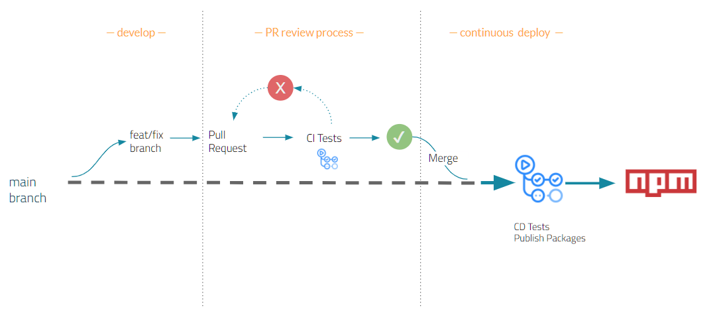

# Contributing Guidelines

[TODO: flesh this out]
These are general contributing guidelines for all packages. For individual contributing guidelines, refer to:

- [TODO: add brand/package specific links]()
- ...

## Guidelines

For general questions, ping [#TBD]() slack channel. [TODO: flesh this out]

## Creating/changing components

[TODO: add dos and donts]

## Submitting Changes

### Working on a feature/bugfix

- Clone the repo (Alternatively you can fork the repo, but if you are developing against this code ask one of the admins for push permissions)
- Create a new branch for your story
- Make changes, add tests expecting correct functionality
- Commit and push your code
- Create a pull request (PR) and follow the [PR review process](#pullrequests)

### Breaking changes

- [TODO: flesh this out]

### Pull requests

Ensure the PR is clean and well structured. The description should explain the purpose of the PR and if possible, some context around it. Follow the [styleguide](#pullrequestsstyles) for creating meaningful PR titles.

- Once the PR is created, automated CI builds will kick off tests and code coverage checks.
- If the build fails, identify the errors and fix them. Commit and push your fixes and wait for CI build to pass.
- If necessary, reach out to respective code owners, peers or SMEs to get your PR reviewed and approved.
- Once approved, `Squash & Merge` your PR into `main` branch.
- Wait for CD processes to complete. Verify your package is published correctly.

## Reporting Bugs

Before submitting a bug, please do the following:

- check existing issues
- try older versions
- perform basic troubleshooting steps

## Proposing New Features

[TODO: flesh out RFC process]

## Style guide / Conventions

[TODO: add coding conventions, design styles etc.]

### Pull requests styles

#### Header

Choose a concise PR title explaining it's purpose. Use [Conventional Commit Specs](https://www.conventionalcommits.org/) for creating PR titles. Think of this as a headline - stick to 6-8 words and under 50 characters.

#### Description

If necessary, add detailed body. E.g., motivation behind changes, more detail into how functionality might be affected, etc.

#### Optional footer

Add details about any associated issues, PRs, etc. E.g., `fixes JIRA-123`

### Commit Message style

Use [Conventional Commit Specs](https://www.conventionalcommits.org/) for creating commit messages.

- **feat** A new feature
- **fix** A bug fix
- **docs** Changes to documentation only
- **style** Style/format changes (whitespace, etc.)
- **refactor** Changes not related to a bug or feature
- **perf** Changes that affects performance
- **test** Changes that add/modify/correct tests
- **build** Changes to build system (configs, etc.)
- **ci** Changes to CI pipeline/workflow

[TODO: add some examples, flesh this out more]
