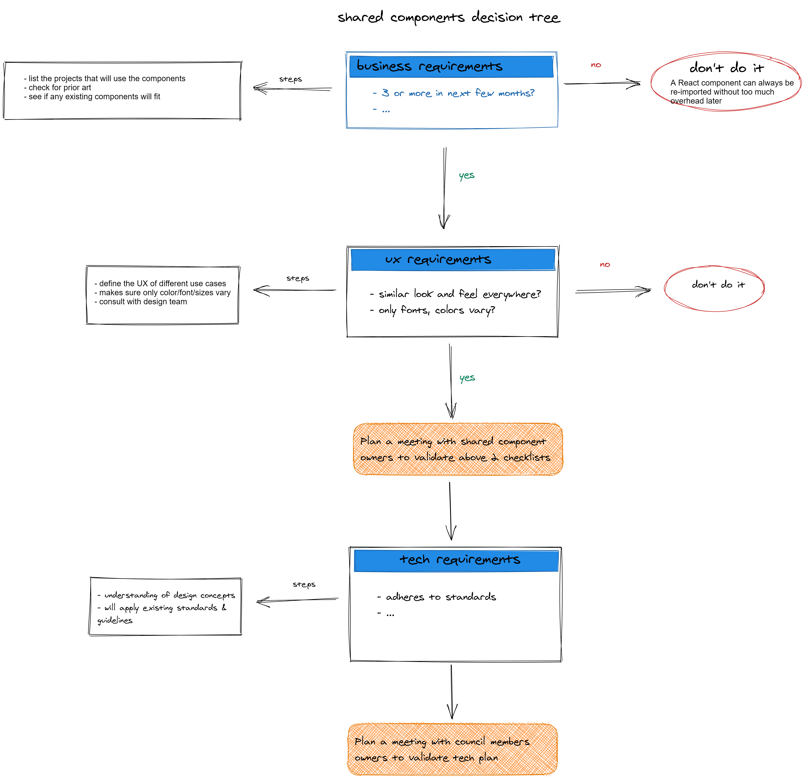
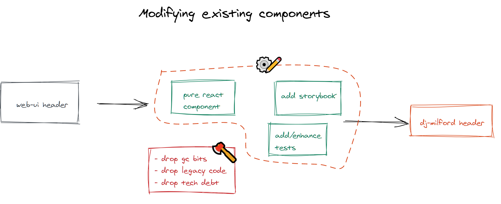

# Component Design

## Component Classifications


### Atom

The smallest unit that is very generic and totally composable. Dumb components that accepts props and make no decision on their own (including styles); React hooks, headless UI components, shared utils, test helpers, mocks etc. would be some examples of such components. They make good candidates to live in `shared` repo.

### Molecule

Molecule is the first unit that makes business decisions ranging from business logic to styles. These are composable within the brand/product and can be made up of atoms. Some molecules can also be shared if they are generic enough. Molecules usually live under `/<brand>` repos but can occasionally be part of `/shared` as well.

### Organism

An organism is a group of molecules, atoms composed together to form a feature on a page.

[Food for thought: should the be part of UI library or app itself?]

### Example


## Props

To get the best performance out of React, avoid unwanted bugs, and keep code clean for everyone, keep the following in mind when adding props to your components:

- **Props are read-only. It is the only [strict rule](https://reactjs.org/docs/components-and-props.html#props-are-read-only) in React, and breaking it can cause unwated side effects that can lead to bugs.**
- **Props should, in most if not all cases, have a default value. By setting default values, we always know what to expect when a component is incorrectly defined.**
- Props should, in most cases, have [primitive values](https://developer.mozilla.org/en-US/docs/Web/JavaScript/Data_structures#primitive_values) (String, Numbers, Boolean, etc.) and keep their defined initial type. For example, if you define a prop as a number, avoid changing it later to a string or a boolean. Another example, if your prop is a string or a number, avoid setting its initial value as `null`.
- Avoid passing objects as props. Props should be predictable, objects are not. There are obvious cases when you'd need to pass an object for a prop, like article data. In this case, try to keep them one level deep and make sure to use default values when destructuring the data you need.
- Props should be directly related to their component. This mostly applies to organisms or features, but consider using [Context](https://reactjs.org/docs/context.html) in cases where you are passing data that is not directly related to the component and should already be available elsewhere like global user or article data.

## Composition, HOC's and Hooks

Sometimes when creating a component or adding new features to it you may run into two situations:

1. Your logic seems highly generic, and can easily be independent. For example, you may want to get the current window width, or check if your component is currently within visibility range. In these cases, consider creating a [Hook](https://reactjs.org/docs/hooks-intro.html) instead so in the future others can benefit from your work and it is easy to maintain and improve.
2. You are adding a feature to a component that does not seem to be very related to your component's main functionality. For example, you want to add a frame to a generic `<Image />` component. This image component's main functionality is generating the markup to render a plain image. At most it could have lazy loading, so adding anything extra seems overcomplicating what should be a simple component. In this case, consider using [Composition](https://reactjs.org/docs/composition-vs-inheritance.html) to create a component that wraps your component, or a [Higher-Order Component](https://reactjs.org/docs/higher-order-components.html) which is basically a function that enhances your component by adding additional markup or logic.

## Accessibility

When creating new components or modifying existing ones, always keep in mind that some of our users have disabilities that force them to navigate our site with their [keyboards](https://developer.mozilla.org/en-US/docs/Web/Accessibility/Understanding_WCAG/Keyboard) or assistive software/devices. Most times the easiest way to make sure that your component is accessible is by writing [semantic html](https://developer.mozilla.org/en-US/docs/Glossary/Semantics) and using `html` elements for what they are intended.
In general, avoid using `div`'s for everything, and check to see if there is a more fit element to use. If your container has no need for classes or html attributes, consider using a [Fragment](https://reactjs.org/docs/fragments.html) instead to avoid unnecessary DOM elements.
Writing fully accessible components is not an easy task, so if you're not sure on how to improve accessibility when working on a component please reach out to your teammates for help.

## Shared Components

Shared components are components that are widely used across products with a shared UX. They encapsulate logic that is shared across products allowing all to benefit from their utility.

Product specific design should be customizable based on props or themes without the need to change markup.

Shared components should not include any product specific logic. Accordingly props should all be generic and not reference specific products.

**When creating a new shared component, consider doing so as a [standalone package](stand-alone-guidelines.md).** The main reason for this is that some projects may only require a single or very few shared components, so while tree shaking may help with keeping the client bundle thin, install and build sizes may be increased and we may run into issues with breaking upgrades on components that are not used. Unless your shared component is deeply mixed with other shared components, there are very few reasons to add it to the shared package.

### Complexity

Development on shared components is complex and adds to cost (time and effort). Only components that have sufficient complexity to warrant the cost of upkeep should be shared, ensuring that the cost of developing on Shared Components is worth the gain.

### New Features

Product specific features that are unlikely to be implement across all products should not be included in a shared component.

Features that are intially being implemented for a single product, with the possibility of wider use, should take into account the current complexity of the component when deciding if adding the logic to the existing shared component is recommended.


### How to Share

There are many different ways to create shareable components, but initially we will focus on two types:

1. Themeable: these components will share 100% of logic and markup, their only difference will come from their themes which will only be able to change things like fonts, colors, spacing, etc. Additionally, while not required, you also have the option to set a default value in case your css variable is not defined in the document. In the following example we are exporting a button styled with styled components, with css properties that have values that come from previously defined css variables:

   ```js
   const Button = styled.button`
     color: var(--my-color, #f00);
     font-family: var(--my-font, 'Consolas, monaco, monospace');
     font-size: var(--my-font-size, 18px);
   `

   export default Button
   ```

2. Headless: these components will be purely logic based, and will let the developer bring their own UI to use. Headless components are especially useful for very complex, logic-heavy components that may require unique UI's per product. A very basic example would be the following component that counts the number of times a button has been clicked:

```js
const Counter = () => {
  const [count, setCount] = useState(0)
  const handleClick = () => {
    setCount(count + 1)
  }
  return (
    <div>
      <p>{`The button has been clicked ${count} times!`}</p>
      <button onClick={handleClick}>Click me</button>
    </div>
  )
}
```

This looks good, and seems shareable. However if a product wanted to introduce breaking changes to the UI, like removing the button after N clicks, this would create a problem. Luckily, by converting this into a headless component all the logic is shared and each team can work with whatever UI they require:

```js
// Headless component
const Counter = ({ children }) => {
  const [count, setCount] = useState(0)
  const handleClick = () => {
    setCount(count + 1)
  }
  return children({ count, handleClick })
}

// Component that uses the headless component and brings its own UI
const CounterUI = () => (
  <Counter>
    {({ count, handleClick }) => (
      <div>
        <p>{`The button has been clicked ${count} times!`}</p>
        {count < 5 && <button onClick={handleClick}>Click me</button>}
      </div>
    )}
  </Counter>
)
```

This works by letting your headless component take care of the logic, and then injecting props to its children as a function.
Additionally, if having to bring your own UI everytime sounds like a lot, you can always set a default UI to use if `children` is not defined in the headless component.

## Migrating components

You can migrate existing web-ui or other components to get a jump start on developing a component. A typical migration flow would involve the following steps


