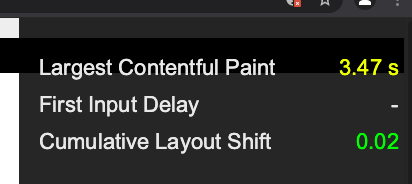
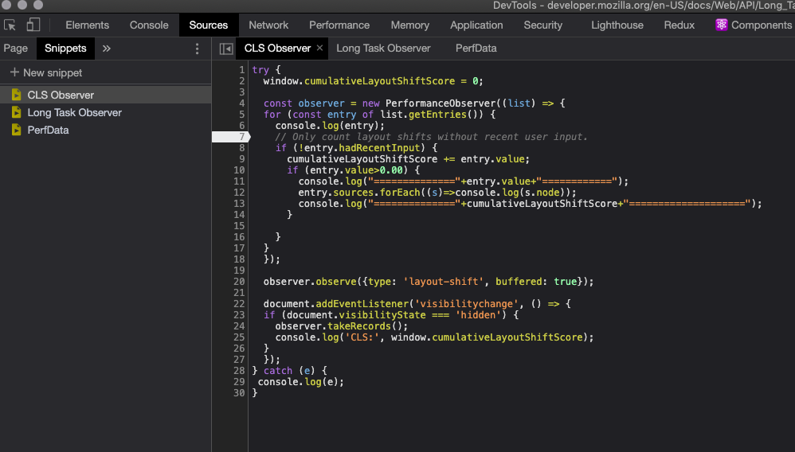

# Best practices

## Be Mindful of Layout Shift

Make sure any components with transitions do not cause layout shift. The collapse and opening of the header is an example where this problem has occurred. One easy way to test is the new Web Vitals Heads-Up Display (HUD) in Chrome DevTools (Canary only as of early 2021). It's nested under the rendering sub-tab, but with dev tools open hit CMD+SHIFT+P, type "Web Vitals", and the option to enable will appear. It looks like this: 

## Use the React Profiler

The React Profiler allows for additional react specific tools within dev tools. You can add it through the chrome extension to your browser [here](https://chrome.google.com/webstore/detail/react-developer-tools/fmkadmapgofadopljbjfkapdkoienihi?hl=en). The tool allows you to see the render time for a component, why it was rendered, and when testing interactions whether the component could benefit from `.memo()`.

While the profiler devtools extension is very useful, it can sometimes be slow to use and when testing within Storybook difficult to isolate the components being tested from Storybook itself.

You can also `import {Profiler} from 'react'` as shown in the snippet below.

```js
import React, { Profiler } from 'react';

function profilerCallback(
  id, // the "id" prop of the Profiler tree that has just committed
  phase, // either "mount" (if the tree just mounted) or "update" (if it re-rendered)
  actualTime, // time spent rendering the committed update
  baseDuration, // estimated time to render the entire subtree without memoization
  startTime, // when React began rendering this update
  commitTime, // when React committed this update
  interactions // the Set of interactions belonging to this update (if any)
) {
  console.log('===================================');
  console.log(`${id}'s ${phase} phase:`);
  console.log(`Actual time: ${actualTime}`);
  console.log(`Base time: ${baseDuration}`);
  console.log(`Start time: ${startTime}`);
  console.log(`Commit time: ${commitTime}`);
  console.log(`Total Commit Time: ${commitTime - startTime}`);
  console.log(`Interactions: ${interactions}`, interactions);
  console.log('####################################');
  // console.log(`Interactions: ${interactions}`);
}
```

Then you can wrap whatever components you're interested in seeing timings for with the the `<Profiler id=componentName onRender={profilerCallback}>` like so:

```jsx
<App>
  <Profiler id="WSJHeader" onRender={profilerCallback}>
    <WSJHeader {...props} />
  </Profiler>
  <Profiler id="Ribbon" onRender={profilerCallback}>
    <Ribbon {...props} />
  </Profiler>
</App>
```

## Use Dev Tools to Audit and Catch Issues

Beside's using the "mobile" emulator mode that we often use, try going to the _Performance_ tab, and add CPU throttling of 4x or 6x. Our high end devices can bias our understanding of user experience. If you're testing a full-featured component, run your own lighthouse test from within dev tools. Especially if your component is using transitions, or has interactions. Lighthouse will inform if you're using [non-composited-animations](https://web.dev/non-composited-animations/), for instance, which we've seen hurt our page's cumulative layout-shift (CLS).

The snippets tab in dev tools is an underutilized feature and a great place to stash quick performance checks. Performance Observers, with their "buffered" option allow you to extract each web vital easily, and information on elements involved, which provides more useful information than the Chrome HUD feature mentioned above.



The same basic snippet can be used for Long Tasks API. A good example where you might want to test this is if the component fetches data clientside, especially if it has to do so before responding to an interaction, like an "article share".

## CI/CD Performance Checks

More information on automated regression testing for the component library, and its integration with renders will follow. For now we're planning:

### Bundle size checks

Automated check that analyzes the bundle size when a commit is pushed to a PR. The new stats are compared to the benchmark stats stored in main branch and the delta is reported in the PR. This flags any unwanted bundle size increases for PR reviewers. This is especially important for catching third party libraries.

### Build time checks

Automated check that analyzes the yarn install when a commit is pushed to a PR. This flags any potential increases to PR reviewers so that corrective actions can be taken.

## Additional Resources

- [Optimize for Core Web Vitals](https://youtu.be/AQqFZ5t8uNc)
- [Fixing common Web Vitals issues](https://youtu.be/IB3e8SAdBaE)
- [UX patterns optimized for Core Web Vitals](https://youtu.be/EUxrBG_98hQ)
