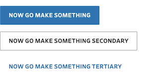

# @newscorp-ghfb/barrons-react-library

Barron's React components

## Important Links

- See [`dj-rendering README`](https://github.com/newscorp-ghfb/dj-rendering#dj-rendering)

## Setup

`@newscorp-ghfb/barrons-react-library` is published as a private GitHub package, and so you will need to authenticate with a token in order to install.

- [Generate a Personal Access Token and Enable SSO Access](https://docs.github.com/en/free-pro-team@latest/github/authenticating-to-github/creating-a-personal-access-token)
  - Add the permissions `read:package` and `repo`
  - Make sure `Enable SSO` is turned ON, click on authorize (You will need to do this even if you are updating the scope of an existing Token).
- [Log in to npm using the Token you generated](https://docs.github.com/en/free-pro-team@latest/packages/using-github-packages-with-your-projects-ecosystem/configuring-npm-for-use-with-github-packages#authenticating-with-a-personal-access-token)
- Add this to your `~/.npmrc` file: `@newscorp-ghfb:registry=https://npm.pkg.github.com`

### Running locally

Once you're in `dj-rendering/packages/barrons-react-library`:

```bash
yarn start
```

### Install

Once you're authenticated, simply install like any other node module:

```bash
yarn add --dev @newscorp-ghfb/barrons-react-library
```

Or if your project uses `npm`:

```bash
npm i @newscorp-ghfb/barrons-react-library --save
```

You must also install `styled-components`, `react`, and `react-dom` in your app. They're all `peerDependencies`.

```bash
yarn add styled-components react react-dom
```

## Usage

```js
import { Button } from '@newscorp-ghfb/barrons-react-library';

export default function Home() {
  return (
    <div>
      <p>
        <Button primary>Now Go Make Something</Button>
      </p>
      <p>
        <Button secondary>Now Go Make Something Secondary</Button>
      </p>
      <p>
        <Button tertiary>Now Go Make Something Tertiary</Button>
      </p>
    </div>
  );
}
```



### Server Side Rendering

Styled Components offers a few utilities for enabling server side rendering. If you're working with `nextjs`, follow the directions [here](https://styled-components.com/docs/advanced#nextjs).

There are docs for other frameworks at that link as well.

## Developing

```bash
git clone git@github.com:newscorp-ghfb/dj-rendering.git
cd dj-rendering
yarn
cd packages/barrons-react-library
yarn start
```

This will boot up a storybook development environment for you.

### `nvm`

If you use [`nvm`](https://github.com/creationix/nvm), you can run `nvm use` to switch to the version of node specified in [`.nvmrc`](https://github.com/creationix/nvm#nvmrc).

### Local Development

Read more in the [local development guide](./docs/local-development.md).

## Tests

```bash
yarn test
```

## Distributing

`@newscorp-ghfb/barrons-react-library` is distributed as commonjs (node) and ecmascript modules. The component source is transpiled to es5 and can be tree-shaken from the app's final bundle.

### Versioning

New versions are distributed by the [monorepo using `lerna`](https://github.com/newscorp-ghfb/dj-rendering#cicd-process).
