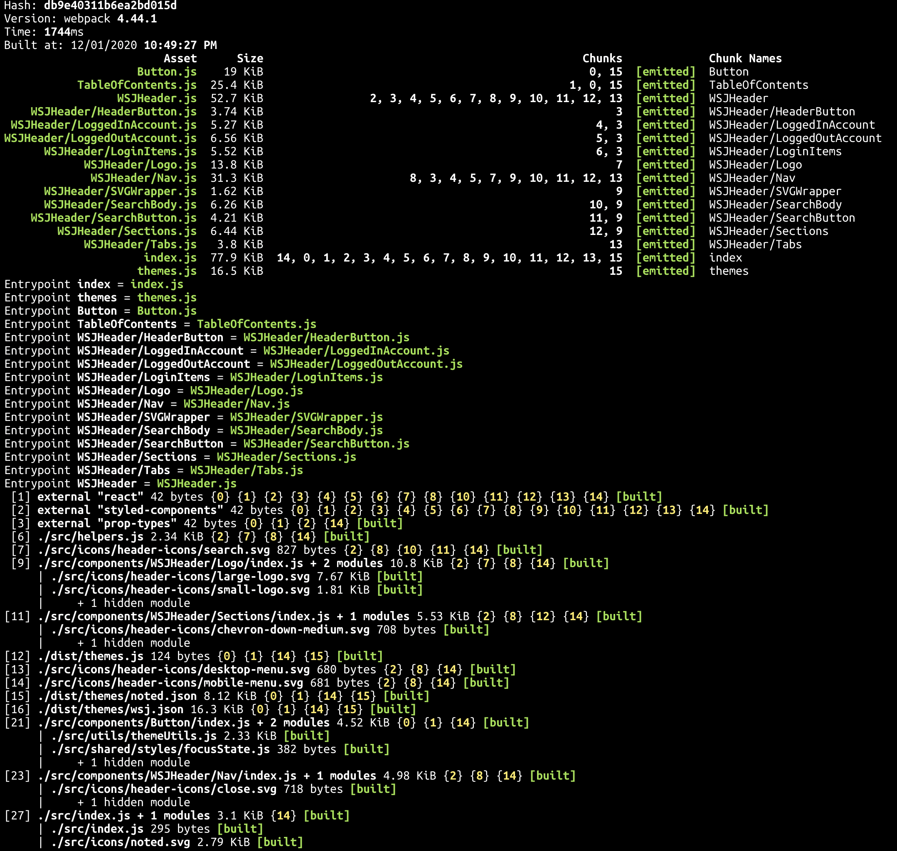
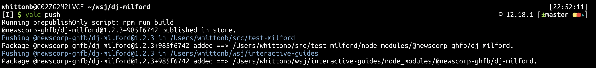

# `@newscorp-ghfb/wsj-react-library` Local Development

You can use storybook to develop components in isolation or you can link to local builds as if you were installing `@newscorp-ghfb/wsj-react-library` from the registry.

## Linking Local builds

### Generate a build

We use webpack to build our library into a single bundle and discrete chunks, which is published to the registry.

```bash
yarn run build
```



In addition to each component file found during the build process, this creates a big module in `dist/index.js`, which includes all the design tokens, theme objects, and components. What actually ends up in this file is driven by what's exported from `src/index.js`:


### Publish a local build

We use [`yalc`](https://github.com/whitecolor/yalc) to sanely link local dependencies. This way you can work in `@newscorp-ghfb/wsj-react-library` and see how your changes affects an upstream app.

Publish a build (see previous step) to your local store.

```bash
yalc publish
```


Or build and publish in one step (note this runs the `prepublishOnly` script):

```sh
yalc push
```



## Watching

If you're working locally, set up a watcher for yourself with the help of `nodemon`:

```sh
npx nodemon --ignore dist -x yalc push
```

By default `nodemon` will watch any `.js` file in the tree and will run `yalc push`, which builds and pushes the library into your local store.

## Linking

Go to your test app (next.js, cra, vanilla react); and add your locally built `@newscorp-ghfb/wsj-react-library`:

```bash
yalc add @newscorp-ghfb/wsj-react-library
```


This will install `@newscorp-ghfb/wsj-react-library` _as if it were installed from a registry_, which means you don't need to do any kind of cross-project linking of react or anything like that.

### Other Dependencies

You must install `styled-components` in your app; it's a `peerDependency`, along with `react` and `react-dom`.

## Using Storybook/DSM

```bash
yarn run dsm-storybook:preview
```

This will open a browser with storybook running, where you can interact with all the registered components.
